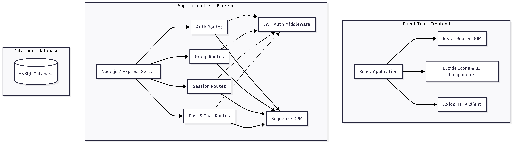
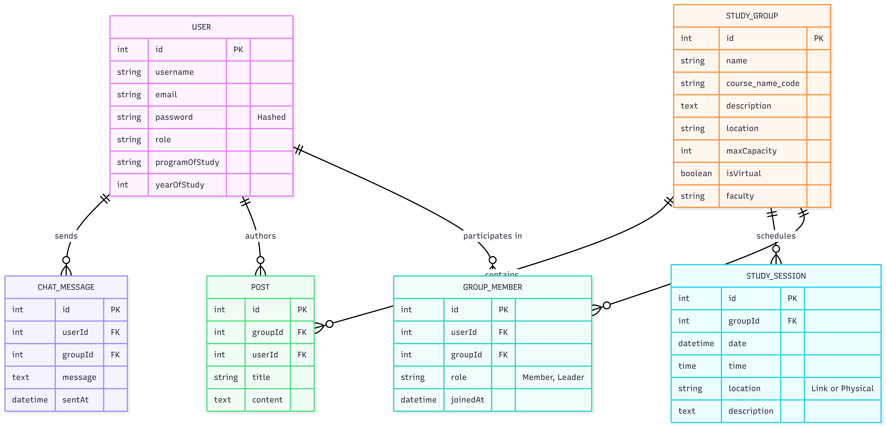

# Student Study Group Finder — Project Documentation (Summary)

This Markdown file is a short, easy-to-read companion to `Project_Documentation.tex` (the full submission report).

## System Architecture

The system follows a three-tier architecture:
- **Client tier (Frontend)**: React (Vite), React Router, Axios
- **Application tier (Backend)**: Node.js + Express REST API, JWT auth
- **Data tier (Database)**: MySQL accessed via Sequelize ORM

## Database (ER Diagram)

The database is designed to be normalized and to enforce referential integrity for users, groups, memberships, sessions, posts, and chat messages.

## User Manual (Quick Guide)

- **Register/Login**: Create an account, then login to access the dashboard.
- **Join a group**: Browse/search groups and click **Join Group**.
- **Create a group**: Create a new group and become the **Group Leader**.
- **Schedule sessions**: Create group sessions with date/time/location/link.
- **Communicate**: Use posts for announcements/questions; use chat for quick coordination.

## API (Implemented Endpoints)

Base URL:
- Local: `http://localhost:5000/api`

Auth header for protected routes:
- `Authorization: Bearer <JWT_TOKEN>`

### Health
- **GET** `/health` — API availability check

### Auth (`/auth`)
- **POST** `/auth/register`
- **POST** `/auth/login`
- **GET** `/auth/me` (protected)

### Groups (`/groups`)
- **POST** `/groups` (protected)
- **GET** `/groups`
- **GET** `/groups/:id`
- **POST** `/groups/:id/join` (protected)
- **DELETE** `/groups/:id/members/:userId` (protected)
- **PUT** `/groups/:id/leader/:userId` (protected, admin only)
- **GET** `/groups/feedback/admin/join` (protected, admin only)

### Sessions (`/sessions`)
- **POST** `/sessions/group/:groupId` (protected)
- **GET** `/sessions/group/:groupId` (protected)

### Posts (`/posts`)
- **POST** `/posts/group/:groupId` (protected)
- **GET** `/posts/group/:groupId` (protected)

### Chat (`/chat`)
- **POST** `/chat/messages` (protected)
- **GET** `/chat/messages?room=global&limit=20` (protected)

## Running Locally (Essentials)

Backend env vars (see `backend/.env.example`):
- `PORT=5000`
- `DB_HOST`, `DB_USER`, `DB_PASS`, `DB_NAME`
- `JWT_SECRET`
- `ADMIN_SIGNUP_CODE`

For production frontend deployments, set:
- `VITE_API_BASE_URL=https://<your-backend-domain>/api`
